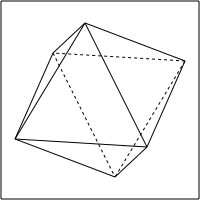

# hsidoc

This repository contains the source code to create the diagrams for the HSI project.

## This is just a test section

See: [https://stackoverflow.com/questions/11293026/default-background-color-of-svg-root-element](https://stackoverflow.com/questions/11293026/default-background-color-of-svg-root-element)

## Running the examples in GHCi

* :set args -o diagrams.svg -w 400
* :set args -o \<filename\>.svg -w 400

These parameters are stored in the .ghci file

Use the **main** function and not `:main`

## Useful API documentations

* General Attributes [Diagram.Attributes](https://diagrams.github.io/haddock/diagrams-lib/Diagrams-Attributes.html)
* 2-Dim Attributes [Diagrams.TwoD.Attributes](https://diagrams.github.io/haddock/diagrams-lib/Diagrams-TwoD-Attributes.html)
* Layout Combinators [Diagrams.Combinators](https://diagrams.github.io/haddock/diagrams-lib/Diagrams-Combinators.html)

## Docs for diagrams

* [Quick Tutorial](https://diagrams.github.io/doc/quickstart.html)
* [User Manual](https://diagrams.github.io/doc/manual.html)
* [API Documentation](https://diagrams.github.io/haddock/index.html)
* [Color names](https://hackage.haskell.org/package/colour-2.3.6/docs/Data-Colour-Names.html)
